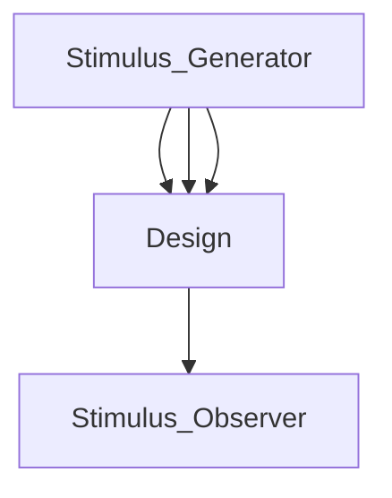
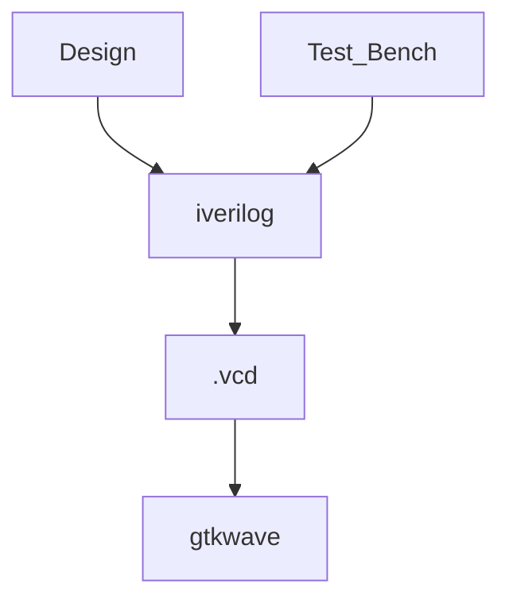
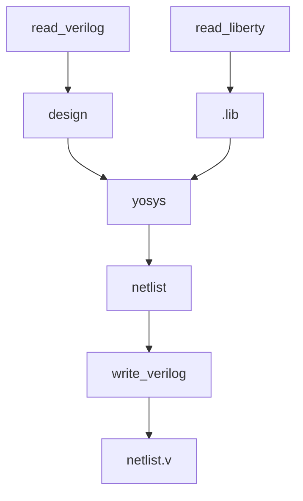
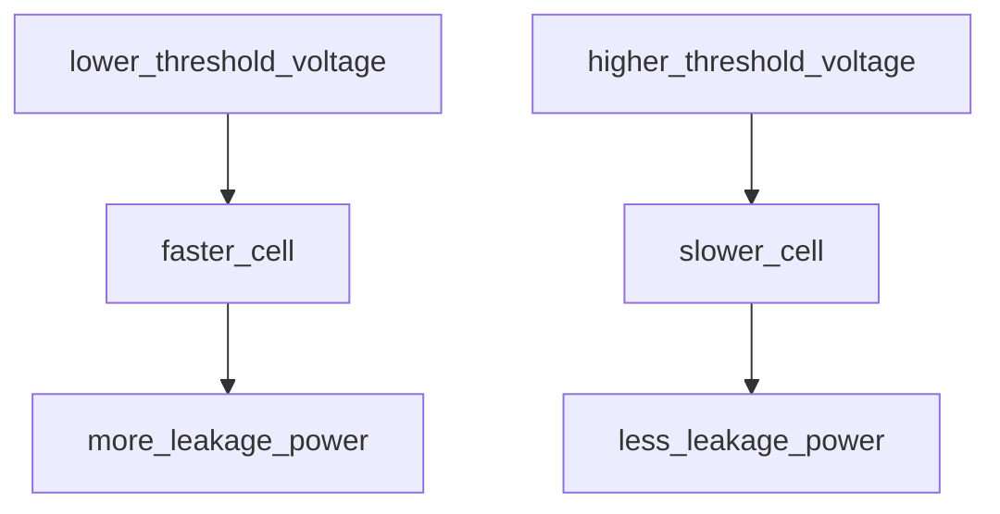

# Table of Contents

- [Day 1](#day-1)
  - [iVerilog Introduction](#iverilog-introduction)
    - [Testbench](#testbench)
    - [iVerilog Simulation Flow](#iverilog-simulation-flow)
  - [MUX Simulation using iVerilog](#mux-simulation-using-iverilog)
  - [Yosys Introduction](#yosys-introduction)
    - [Yosys synthesis flow](#yosys-synthesis-flow)
  - [Setup and Hold time](#setup-and-hold-time)
    - [Setup Time (Max. Delay) Constraints](#setup-time-max-delay-constraints)
    - [Hold Time (Min. Delay) Constraints](#hold-time-min-delay-constraints)
    - [Fast cells vs Slow cells](#fast-cells-vs-slow-cells)
    - [MUX Synthesis using Yosys](#mux-synthesis-using-yosys)
- [Day 2](#day-2)
  - [dot Lib file](#dot-lib-file)
  - [Hierarchial vs Flat Synthesis](#hierarchial-vs-flat-synthesis)
    - [Hierarchial Synthesis](#hierarchial-synthesis)
    - [Why NAND gate is used (sometimes) by the tool for OR/NOR gate implementation?](#why-nand-gate-is-used-sometimes-by-the-tool-for-ornor-gate-implementation)
    - [Flat Synthesis](#flat-synthesis)
    - [Sub-module level synthesis](#sub-module-level-synthesis)
  - [Flip Flops and Flop coding styles](#flip-flops-and-flop-coding-styles)
    - [Glitches (Hazards)](#glitches-hazards)
    - [Asynchronous Vs Synchronous](#asynchronous-vs-synchronous)
    - [DFF with Asynchronous Reset](#dff-with-asynchronous-reset)
    - [DFF with Asynchronous Set](#dff-with-asynchronous-set)
    - [DFF with Synchronous Reset](#dff-with-synchronous-reset)
  - [Special Optimizations](#special-optimizations)
    - [Multiplication by powers of 2](#multiplication-by-powers-of-2)
    - [Multiplication by 9](#multiplication-by-9)
- [Day 3](#day-3)
  - [Intro to tool Optimizations](#intro-to-tool-optimizations)
    - [Reducing the area and power](#reducing-the-area-and-power)
    - [Constant Propagation](#constant-propagation)
    - [Boolean Logic Optimization](#boolean-logic-optimization)
    - [Sequential Constant Propagation](#sequential-constant-propagation)
    - [State Optimization](#state-optimization)
    - [Retiming](#retiming)
    - [Cloning](#cloning)
  - [Combinational Logic Optimizations lab](#combinational-logic-optimizations-lab)
    - [Example 1](#example-1)
    - [Example 2](#example-2)
    - [Example 3](#example-3)
    - [Example 4](#example-4)
    - [Example 5](#example-5)
    - [Example 6](#example-6)
  - [Sequential Optimizations](#sequential-optimizations)
    - [Example 1](#example-1-1)
    - [Example 2](#example-2-1)
    - [Example 3](#example-3-1)
    - [Example 4](#example-4-1)
    - [Example 5](#example-5-1)
  - [Unused outputs optimizations](#unused-outputs-optimizations)
    - [Example 1](#example-1-2)
    - [Example 2](#example-2-2)
- [Day 4](#day-4)
  - [Gate Level Simulation (GLS)](#gate-level-simulation-gls)
  - [Synthesis Simulation Mismatch](#synthesis-simulation-mismatch)
  - [Ternary operator Mux](#ternary-operator-mux)
  - [Bad MUX](#bad-mux)
  - [Blocking Statement - Synthesis Simulation Mismatch](#blocking-statement---synthesis-simulation-mismatch)
- [Day 5](#day-5)
  - [If else construct](#if-else-construct)
  - [Inferred latches for incomplete if else statements](#inferred-latches-for-incomplete-if-else-statements)
  - [Case statement](#case-statement)
  - [Incomplete case statement](#incomplete-case-statement)
  - [Partial assignment of outputs](#partial-assignment-of-outputs)
  - [Avoid overlapping case](#avoid-overlapping-case)
  - [Incomplete if construct lab](#incomplete-if-construct-lab)
    - [Example 1](#example-1-3)
      - [Example 2](#example-2-3)
    - [Incomplete Case statement lab](#incomplete-case-statement-lab)
    - [Case statement with default case](#case-statement-with-default-case)
    - [Case statement with partial output assignments](#case-statement-with-partial-output-assignments)
    - [Switch case statment with overlapping cases](#switch-case-statment-with-overlapping-cases)
  - [Looping constructs](#looping-constructs)
    - [For loop](#for-loop)
    - [For generate](#for-generate)
  - [Looping constructs Labs](#looping-constructs-labs)
    - [Muliplexer using For loop](#muliplexer-using-for-loop)
    - [DeMUX using case statement](#demux-using-case-statement)
    - [DeMUX using for loop](#demux-using-for-loop)
    - [Ripple Carry Adder using for generate](#ripple-carry-adder-using-for-generate)
- [Author](#author)
- [Acknowledgements](#acknowledgements)
- [References](#references)

# Day 1

## iVerilog Introduction

### Testbench

- A testbench provides stimulus to a design under test and observes the output.

- It has many primary inputs and one primary output.
  


<!-- -->

### iVerilog Simulation Flow



<!-- -->

## MUX Simulation using iVerilog

```console
mkdir rtlws
cd ./rtlws
ls
git clone https://github.com/kunalg123/sky130RTLDesignAndSynthesisWorkshop
cd ./https://github.com/kunalg123/sky130RTLDesignAndSynthesisWorkshop
cd ./verilog_files
iverilog good_mux.v tb_good_mux.v
./a.out
gtkwave tb_good_mux.vcd
```


**RTL Simulation**


## Yosys Introduction

- It is a synthesizer which converts the **RTL design** to the **synthesized netlist**.
- netlist is the representation of the design in the **form of the standard cells** present in the standard cell library.
- Same testbench can be used for RTL Design and Synthesized netlist simulation.  
- .lib - library collection of all the standard cells, different versions of the same gate is present

### Yosys synthesis flow



## Setup and Hold time

### Setup Time (Max. Delay) Constraints


- The data should be available **Tsetup**  before the **capturing clock edge** comes.
- We need **fast cells** to satisfy **Max Delay** constraints.
- Setup time constraints are always calculated with respect to the next clock edge.

### Hold Time (Min. Delay) Constraints


- Data should be stable for **T-hold** after the clock edge to be captured properly.
- If the next data comes **earlier than T-hold**, the current data will not be captured properly.
- We need **slow cells** to satisfy **hold time** constraints

### Fast cells vs Slow cells

| Fast cells      | Slower cells     |
| -------------   | -------------    |
| Larger current  | Smaller current  |
| Wider           | Narrower         |
| Less Delay      | More Delay       |
| More power      | Less power       |
| More area       | Less area        |

### MUX Synthesis using Yosys

```console
read_liberty -lib ../my_lib/lib/sky130_fd_sc_hd__tt_025C_1v80.lib
read_verilog good_mux.v
synth -top good_mux 
abc -liberty ../my_lib/lib/sky130_fd_sc_hd__tt_025C_1v80.lib 
show
write_verilog -noattr good_mux_netlist.v 
!gvim good_mux_netlist.v
```

**Steps:**

1. Include (read) the library and the verilog file


2. Select top level module to Synthesize


3. From the RTL Design(Verilog) generate gate-level netlist.
4. Then, map the synthesized netlist to the standard cell libraries **(Technology Mapping)**


5. View the logic


6. Generate (Write) verilog file for the synthesized(mapped) netlist


**RTL code for the synthesized netlist**

```verilog
module good_mux(i0, i1, sel, y);
  wire _0_;
  wire _1_;
  wire _2_;
  wire _3_;
  input i0;
  input i1;
  input sel;
  output y;
  sky130_fd_sc_hd__mux2_1 _4_ (
    .A0(_0_),
    .A1(_1_),
    .S(_2_),
    .X(_3_)
  );
  assign _0_ = i0;
  assign _1_ = i1;
  assign _2_ = sel;
  assign y = _3_;
endmodule
```

# Day 2

## dot Lib file

```console
gvim ../my_lib/lib/sky130_fd_sc_hd__tt_025C_1v80.lib 
```


- tt - typical process
- 25C - optimal working temperature in 25 degrees
- 1v8 - voltage
- dot Lib contains standard cell features and specification
- Also specifies the leakage power and also the timing information for different input combinations




## Hierarchial vs Flat Synthesis


### Hierarchial Synthesis

```console
cd ./verilog_files
yosys
read_liberty -lib ../my_lib/lib/sky130_fd_sc_hd__tt_025C_1v80.lib
read_verilog multiple_modules.v
synth -top multiple_modules
abc -liberty ../my_lib/lib/sky130_fd_sc_hd__tt_025C_1v80.lib 
write_verilog multiple_modules_hier.v
!gvim multiple_modules_hier.v
```

- The hierarchy of the submodules is preserved.
- The structure of the submodules in the original design are preserved in the final synthesized (verilog) file.

**Synthesis Report**


**Synthesized netlist**


<details>

<summary>
<strong> RTL code for the synthesized netlist </strong>
</summary>

```verilog
module multiple_modules(a, b, c, y);
  input a;
  input b;
  input c;
  wire net1;
  output y;
  sub_module1 u1 (
    .a(a),
    .b(b),
    .y(net1)
  );
  sub_module2 u2 (
    .a(net1),
    .b(c),
    .y(y)
  );
endmodule

module sub_module1(a, b, y);
  wire _0_;
  wire _1_;
  wire _2_;
  input a;
  input b;
  output y;
  sky130_fd_sc_hd__and2_0 _3_ (
    .A(_1_),
    .B(_0_),
    .X(_2_)
  );
  assign _1_ = b;
  assign _0_ = a;
  assign y = _2_;
endmodule

module sub_module2(a, b, y);
  wire _0_;
  wire _1_;
  wire _2_;
  input a;
  input b;
  output y;
  sky130_fd_sc_hd__lpflow_inputiso1p_1 _3_ (
    .A(_1_),
    .SLEEP(_0_),
    .X(_2_)
  );
  assign _1_ = b;
  assign _0_ = a;
  assign y = _2_;
endmodule
```

</details>

### Why NAND gate is used (sometimes) by the tool for OR/NOR gate implementation?

- The **logical effort** of a NAND gate is **less** than that of an equivalent NOR gate.


- Logical effort - the amount of current required to **drive** the **input** of a logic gate.
- Logical effort will be **different** for **different inputs** if the gate is **asymmetric**.

### Flat Synthesis

```console
flatten
write_verilog -noattr multiple_modules_flat.v
!gvim multiples_modules_flat.v
```

- Hierarchies are removed.

- **No submodules** are present in the (synthesized) verilog description

**Synthesized netlist**


<details>
<summary>
    <strong>RTL code for the synthesized netlist</strong>
  </summary>

```verilog

module multiple_modules(a, b, c, y);
  wire _0_;
  wire _1_;
  wire _2_;
  wire _3_;
  wire _4_;
  wire _5_;
  input a;
  input b;
  input c;
  wire net1;
  wire \u1.a ;
  wire \u1.b ;
  wire \u1.y ;
  wire \u2.a ;
  wire \u2.b ;
  wire \u2.y ;
  output y;
  sky130_fd_sc_hd__and2_0 _6_ (
    .A(_1_),
    .B(_0_),
    .X(_2_)
  );
  sky130_fd_sc_hd__lpflow_inputiso1p_1 _7_ (
    .A(_4_),
    .SLEEP(_3_),
    .X(_5_)
  );
  assign _4_ = \u2.b ;
  assign _3_ = \u2.a ;
  assign \u2.y  = _5_;
  assign \u2.a  = net1;
  assign \u2.b  = c;
  assign y = \u2.y ;
  assign _1_ = \u1.b ;
  assign _0_ = \u1.a ;
  assign \u1.y  = _2_;
  assign \u1.a  = a;
  assign \u1.b  = b;
  assign net1 = \u1.y ;
endmodule  

```

</details>

### Sub-module level synthesis

```console
yosys
read_liberty -lib ../my_lib/lib/sky130_fd_sc_hd__tt_025C_1v80.lib
read_verilog multiple_modules.v
synth -top submodule1
show
```

- This is useful when when we have multiples instances of same module.
- So we can synthesize one module and replicate others.
- Also, the tool may not do a good job in synthesizing a a massive design. So, we synthesize the submodules and combine them.


## Flip Flops and Flop coding styles

### Glitches (Hazards)

- In a combinational circuit, **different paths have different delays**, due to which the output might be unstable before settling to a stable value (Glitch).
- **Flip Flops** can be inserted to minimize the glitches.

<!--Put one image for the hazard from harris and harris book handdrawn-->

- **Static-0 Hazard:** The logic **LOW** output momemtarily goes to logic **HIGH** before settling back to logic **LOW**.  
- **Static-1 Hazard:** Logic **HIGH** output momentarily goes logic **LOW** before settling to logic **HIGH**.
- **Dynamic Hazard:** Output changes multiple times before settling.

### Asynchronous Vs Synchronous

| Asynchronous                              | Synchronous                    |
| ----------------------------------------- | ------------------------------ |
| Priority is given to the async reset(set) | Priority is given to the clock |
| **Immediately** reflected in the output   | Has to **wait till the clock edge** comes                            |
| Included in the sensitivity list          | Not included in the sensitivity list |
| Has a seperate pin                        | Given along with D - input|

### DFF with Asynchronous Reset

**Verilog code for the RTL Design**

```verilog
module dff_asyncres ( input clk,  input async_reset, input d, output reg q );
 always @ (posedge clk, posedge async_reset) begin
  if(async_reset)
   q <= 1'b0;
  else 
   q <= d;
 end
endmodule
```

**RTL Simulation**


**Yosys Synthesis**

```console
read_liberty -lib ../my_lib/lib/sky130_fd_sc_hd__tt_025C_1v80.lib 
read_verilog dff_asyncres.v
synth -top dff_asyncres
dfflibmap -liberty ../my_lib/lib/sky130_fd_sc_hd__tt_025C_1v80.lib
abc -liberty ../my_lib/lib/sky130_fd_sc_hd__tt_025C_1v80.lib 
show dff_asyncres

```


### DFF with Asynchronous Set

**Verilog code for the RTL Design**

```verilog
module dff_async_set ( input clk,  input async_set, input d, output reg q );
 always @ (posedge clk, posedge async_set) begin
  if(async_set)
   q <= 1'b1;
  else 
   q <= d;
 end
endmodule
```

**RTL Simulation**


**Yosys Synthesis:**

```console
read_liberty -lib ../my_lib/lib/sky130_fd_sc_hd__tt_025C_1v80.lib 
read_verilog dff_async_set.v
synth -top dff_async_set
dfflibmap -lib ../my_lib/lib/sky130_fd_sc_hd__tt_025C_1v80.lib 
abc -liberty ../my_lib/lib/sky130_fd_sc_hd__tt_025C_1v80.lib 
show dff_async_set
```


### DFF with Synchronous Reset

```verilog
module dff_syncres ( input clk, input sync_reset, input d , output reg q );
 always @ (posedge clk ) begin
  if (sync_reset)
   q <= 1'b0;
  else 
   q <= d;
 end
endmodule
```


**Yosys Synthesis**

```console
read_liberty -lib ../my_lib/lib/sky130_fd_sc_hd__tt_025C_1v80.lib 
read_verilog dff_syncres.v 
synth -top dff_syncres
dfflibmap -lib ../my_lib/lib/sky130_fd_sc_hd__tt_025C_1v80.lib 
abc -liberty ../my_lib/lib/sky130_fd_sc_hd__tt_025C_1v80.lib 
```


## Special Optimizations

### Multiplication by powers of 2

- The tool infers **left shifting** operation for multiplication by powers of 2.
- The number of shifting is given by **log2(power)**.

**Verilog code for RTL Design**

```verilog
module mul2 (input [2:0] a, output [3:0] y);
 assign y = a * 2;
endmodule
```

**Synthezised netlist**


**Verilog code for the synthesized netlist**

```verilog
module mul2(a, y);
  input [2:0] a;
  output [3:0] y;
  assign y = { a, 1'b0 };
endmodule
```

### Multiplication by 9

**Verilog code for RTL Design**

```verilog
module mult8 (input [2:0] a , output [5:0] y);
 assign y = a * 9;
endmodule
```

**Synthezised netlist**


**Verilog code for the synthesized netlist**

```verilog
module mult8(a, y);
  input [2:0] a;
  output [5:0] y;
  assign y = { a, a };
endmodule
```

# Day 3

## Intro to tool Optimizations

### Reducing the area and power

- Some gates can be replaced with equivalent smaller gates to reduce the area and power.

### Constant Propagation

- Sometimes, if one of inputs is tied to ground or VDD, the circuit can be replaced with a simpler circuit.

### Boolean Logic Optimization

- k-maps or Quine-McCluskey algorithm can be used for simplifying the logic function.

### Sequential Constant Propagation

- In a **reset-enabled** Flip Flop, if the D-input is tied to logic **LOW**, then the tool does not include the flip flop during synthesis.  
- In a **set-enabled** flip flop, if the D-input is tied to logic **HIGH**, the tool does not include a flip flop during synthesis.

### State Optimization

### Retiming


### Cloning


## Combinational Logic Optimizations lab

(Include image of simplification for the examples with names)

### Example 1

**Verilog code for the RTL Design**

```verilog
module opt_check (input a , input b , output y);
 assign y = a ? b : 0;
endmodule
```

> This reduces to **a AND b**

**Command to provide optimization**

```console
// this command removes the extra unneccessary logic
opt_clean -purge
```

**Synthesized netlist**


**Verilog code for the synthesized netlist**

```verilog
module opt_check(a, b, y);
  wire _0_;
  wire _1_;
  wire _2_;
  input a;
  input b;
  output y;
  sky130_fd_sc_hd__and2_0 _3_ (
    .A(_1_),
    .B(_0_),
    .X(_2_)
  );
  assign _1_ = b;
  assign _0_ = a;
  assign y = _2_;
endmodule
```

### Example 2

**RTL Verilog Code:**

```verilog
module opt_check2 (input a , input b , output y);
 assign y = a?1:b;
endmodule
```

> This reduces to **A OR (NOT(A) AND B)**

```console
opt_clean -purge
```

**Synthesized netlist**


**Verilog code for synthesized netlist**

```verilog
module opt_check2(a, b, y);
  wire _0_;
  wire _1_;
  wire _2_;
  input a;
  input b;
  output y;
  sky130_fd_sc_hd__lpflow_inputiso1p_1 _3_ (
    .A(_0_),
    .SLEEP(_1_),
    .X(_2_)
  );
  assign _0_ = a;
  assign _1_ = b;
  assign y = _2_;
endmodule
```

### Example 3

```verilog
module opt_check3 (input a , input b, input c , output y);
 assign y = a?(c?b:0):0;
endmodule
```
<!-- Include image for expected circuit -->

**Synthesized netlist**


**Verilog code for the synthesized netlist**

```verilog
module opt_check3(a, b, c, y);
  wire _0_;
  wire _1_;
  wire _2_;
  wire _3_;
  wire _4_;
  input a;
  input b;
  input c;
  output y;
  sky130_fd_sc_hd__and3_1 _5_ (
    .A(_2_),
    .B(_3_),
    .C(_1_),
    .X(_4_)
  );
  assign _2_ = b;
  assign _3_ = c;
  assign _1_ = a;
  assign y = _4_;
endmodule
```

### Example 4

**Verilog code for the RTL Design**

```verilog
module opt_check4 (input a, input b, input c , output y);
 assign y = a?(b?(a & c ):c):(!c);
endmodule
```

**Synthesized netlist**


**Verilog code for synthesized netlist**

```verilog
module opt_check4 (a, b, c, y);
  wire _0_;
  wire _1_;
  wire _2_;
  input a;
  input b;
  input c;
  output y;
  sky130_fd_sc_hd__xnor2_1 _3_ (
    .A(_0_),
    .B(_1_),
    .Y(_2_)
  );
  assign _0_ = a;
  assign _1_ = c;
  assign y = _2_;
endmodule
```

### Example 5

**Verilog Code for RTL Design**

```verilog
module sub_module1(input a , input b , output y);
  assign y = a & b;
endmodule

module sub_module2(input a , input b , output y);
  assign y = a ^ b;
endmodule

module multiple_module_opt(input a , input b , input c , input d , output y);
 wire n1,n2,n3;

 sub_module1 U1 (.a(a) , .b(1'b1) , .y(n1));
 sub_module2 U2 (.a(n1), .b(1'b0) , .y(n2));
 sub_module2 U3 (.a(b), .b(d) , .y(n3));

 assign y = c | (b & n1); 


endmodule
```


```verilog
module multiple_module_opt(a, b, c, d, y);
  wire _0_;
  wire _1_;
  wire _2_;
  wire _3_;
  wire _4_;
  wire \U1.y ;
  input a;
  input b;
  input c;
  input d;
  output y;
  sky130_fd_sc_hd__a21o_1 _5_ (
    .A1(_2_),
    .A2(_1_),
    .B1(_3_),
    .X(_4_)
  );
  assign _2_ = b;
  assign _3_ = c;
  assign y = _4_;
  assign _1_ = a;
endmodule
```

### Example 6

```verilog

module sub_module(input a , input b , output y);
 assign y = a & b;
endmodule

module multiple_module_opt2(input a , input b , input c , input d , output y);
 wire n1,n2,n3;

 sub_module U1 (.a(a) , .b(1'b0) , .y(n1));
 sub_module U2 (.a(b), .b(c) , .y(n2));
 sub_module U3 (.a(n2), .b(d) , .y(n3));
 sub_module U4 (.a(n3), .b(n1) , .y(y));

endmodule
```


```verilog
module multiple_module_opt2(a, b, c, d, y);
  wire _0_;
  wire _1_;
  wire _2_;
  wire _3_;
  wire _4_;
  wire \U1.y ;
  wire \U2.y ;
  wire \U3.y ;
  input a;
  input b;
  input c;
  input d;
  output y;
  assign _4_ = 1'h0;
  assign _0_ = a;
  assign _2_ = c;
  assign _1_ = b;
  assign _3_ = d;
  assign y = _4_;
endmodule
```

## Sequential Optimizations

### Example 1

**RTL Verilog Code:**

```verilog
module dff_const1(input clk, input reset, output reg q);
 always @(posedge clk, posedge reset) begin
  if (reset)
   q <= 1'b0;
  else
   q <= 1'b1;
 end

endmodule
```

- Output goes logic **LOW** when reset is applied.
- It returns to logic **HIGH** after reset is disabled.
- Flip flop is retained in this case.
  
**RTL Simulation**


**Synthesis report**


**Synthesized netlist**


<details><summary>
<strong>Verilog Code for the synthesized netlist:</strong>
</summary>

```verilog
module dff_const1(clk, reset, q);
 wire _0_;
 wire _1_;
 wire _2_;
 input clk;
 output q;
 input reset;
 sky130_fd_sc_hd__clkinv_1 _3_ (
  .A(_1_),
  .Y(_0_)
 );
 sky130_fd_sc_hd__dfrtp_1 _4_ (
  .CLK(clk),
  .D(1'h1),
  .Q(q),
  .RESET_B(_2_)
 );
 assign _1_ = reset;
 assign _2_ = _0_;
endmodule
```

</details>

### Example 2

**Verilog code for RTL**

```verilog
module dff_const2(input clk, input reset, output reg q);
 always @(posedge clk, posedge reset) begin
  if(reset)
   q <= 1'b1;
  else
   q <= 1'b1;
 end
endmodule
```

- When reset is applied output goes logic **HIGH**.
- When reset is disabled, output stays at logic **HIGH**.
- Flip flop is **not included** during synthesis.
  
**RTL Simulation**


**Synthesis report**


**Synthesized netlist**


**Verilog code for synthesized netlist**

```verilog
module dff_const2(clk, reset, q);
 input clk;
 output q;
 input reset;
 assign q = 1'h1;
endmodule
```

### Example 3

```verilog
module dff_const3(input clk, input reset, output reg q);
reg q1;

always @(posedge clk, posedge reset)
 begin
  if(reset) begin
   q <= 1'b1;
   q1 <= 1'b0;
  end
  else begin
   q1 <= 1'b1;
   q <= q1;
  end
 end
endmodule
```

- When reset is applied, q -> **HIGH**, q1 -> **LOW**.
- Value of q1 is not immediately reflected at q because of Tcq delay.

**RTL Simulation**


**Synthesized netlist**


<details><summary>
<strong>Verilog Code for the synthesized netlist:</strong>
</summary>

```verilog
module dff_const3(clk, reset, q);
   wire _0_;
   wire _1_;
   wire _2_;
   wire _3_;
   wire _4_;
   input clk;
   output q;
   wire q1;
   input reset;
   sky130_fd_sc_hd__clkinv_1 _5_ (
      .A(_2_),
      .Y(_0_)
   );
   sky130_fd_sc_hd__clkinv_1 _6_ (
      .A(_2_),
      .Y(_1_)
   );
   sky130_fd_sc_hd__dfstp_2 _7_ (
      .CLK(clk),
      .D(q1),
      .Q(q),
      .SET_B(_3_)
   );
   sky130_fd_sc_hd__dfrtp_1 _8_ (
      .CLK(clk),
      .D(1'h1),
      .Q(q1),
      .RESET_B(_4_)
   );
   assign _2_ = reset;
   assign _3_ = _0_;
   assign _4_ = _1_;
endmodule
```

</details>

### Example 4

**Verilog code for the RTL Design**

```verilog
module dff_const4(input clk, input reset, output reg q);
 reg q1;

 always @(posedge clk, posedge reset) begin
  if(reset)
  begin
   q <= 1'b1;
   q1 <= 1'b1;
  end
  else
  begin
   q1 <= 1'b1;
   q <= q1;
  end
 end
 
endmodule
```

- In this the Flip flops are **initialized** to logic **HIGH** after the reset.
- The **input** to the first flip flop is also logic **HIGH**.
- When, the reset is disabled the output of both q and q1 Flip flop remains at logic **HIGH**.
- **No flip flop** is included during synthesis.

**RTL Simulation**


**Synthesis report**


**Synthesized netlist**


**Verilog code for the synthesized netlist**

```verilog

module dff_const4(clk, reset, q);
 input clk;
 output q;
 wire q1;
 input reset;
 assign q = 1'h1;
 assign q1 = 1'h1;
endmodule
```

### Example 5

**Verilog code for the RTL Design**

```verilog
module dff_const5(input clk, input reset, output reg q);
reg q1;

 always @(posedge clk, posedge reset) begin
  if(reset) begin
   q <= 1'b0;
   q1 <= 1'b0;
  end
  
  else begin
   q1 <= 1'b1;
   q <= q1;
  end
 end

endmodule
```

- Both the FFs are **initialized to zero** by the reset.
- But input is tied to logic **HIGH**.
- Input given to the first FF is reflected one cycle later in the second FF due to **Tcq**.
- **Flip flops are included** during the synthesis.

**RTL Simulation**


**Synthesis report**


**Synthesized netlist**


<details><summary>
<strong>Verilog Code for the synthesized netlist:</strong>
</summary>

```verilog
module dff_const5(clk, reset, q);
  wire _0_;
  wire _1_;
  wire _2_;
  wire _3_;
  wire _4_;
  input clk;
  output q;
  wire q1;
  input reset;
  sky130_fd_sc_hd__clkinv_1 _5_ (
    .A(_2_),
    .Y(_0_)
  );
  sky130_fd_sc_hd__clkinv_1 _6_ (
    .A(_2_),
    .Y(_1_)
  );
  sky130_fd_sc_hd__dfrtp_1 _7_ (
    .CLK(clk),
    .D(q1),
    .Q(q),
    .RESET_B(_3_)
  );
  sky130_fd_sc_hd__dfrtp_1 _8_ (
    .CLK(clk),
    .D(1'h1),
    .Q(q1),
    .RESET_B(_4_)
  );
  assign _2_ = reset;
  assign _3_ = _0_;
  assign _4_ = _1_;
endmodule
```

</details>

## Unused outputs optimizations

### Example 1

**Verilog code for the RTL Design**

```verilog
module counter_opt (input clk , input reset , output q);
 reg [2:0] count;
 assign q = count[0];

 always @(posedge clk ,posedge reset)
 begin
  if(reset)
   count <= 3'b000;
  else
   count <= count + 1;
 end
endmodule
```

- In this the output **q** needs only the value of **count[0]**, so count[1], count[2] are not present in the synthesized netlist.
- So, only **one Flip flop** is included during synthesis.

**Synthesis report**


**Synthesized netlist**


<details><summary>
<strong>Verilog Code for the synthesized netlist:</strong>
</summary>

```verilog
module counter_opt(clk, reset, q);
  wire _0_;
  wire _1_;
  wire _2_;
  wire _3_;
  wire [2:0] _4_;
  wire _5_;
  input clk;
  wire [2:0] count;
  output q;
  input reset;
  sky130_fd_sc_hd__clkinv_1 _6_ (
    .A(_3_),
    .Y(_1_)
  );
  sky130_fd_sc_hd__clkinv_1 _7_ (
    .A(_2_),
    .Y(_0_)
  );
  reg \count_reg[0] ;
  always @(posedge clk, negedge _5_)
    if (!_5_) \count_reg[0]  <= 1'h0;
    else \count_reg[0]  <= _4_[0];
  assign count[0] = \count_reg[0] ;
  assign _4_[2:1] = count[2:1];
  assign q = count[0];
  assign _3_ = reset;
  assign _5_ = _1_;
  assign _2_ = count[0];
  assign _4_[0] = _0_;
endmodule
```

</details>

### Example 2

**Verilog code for the RTL Design**

```verilog
module counter_opt (input clk , input reset , output q);
 reg [2:0] count;
 assign q = (count[2:0] == 3'b100);

 always @(posedge clk ,posedge reset)
 begin
  if(reset)
   count <= 3'b000;
  else
   count <= count + 1;
 end

endmodule
```

- In this q needs all the **three bits of count**.
- So, **three Flip Flops** are present in the synthesized netlist.


<details><summary>
<strong>Verilog Code for the synthesized netlist:</strong>
</summary>

```verilog
module counter_opt(clk, reset, q);
  wire _00_;
  wire _01_;
  wire [2:0] _02_;
  wire [2:0] _03_;
  wire _04_;
  wire _05_;
  wire _06_;
  input clk;
  wire [2:0] count;
  output q;
  input reset;
  assign _02_[0] = ~count[0];
  assign _01_ = count[1] | count[0];
  assign q = count[2] & ~(_01_);
  assign _03_[1] = count[1] ^ count[0];
  assign _00_ = count[1] & count[0];
  assign _03_[2] = _00_ ^ count[2];
  assign _04_ = ~reset;
  assign _05_ = ~reset;
  assign _06_ = ~reset;
  sky130_fd_sc_hd__dfrtp_1 _16_ (
    .CLK(clk),
    .D(_03_[1]),
    .Q(count[1]),
    .RESET_B(_04_)
  );
  sky130_fd_sc_hd__dfrtp_1 _17_ (
    .CLK(clk),
    .D(_03_[2]),
    .Q(count[2]),
    .RESET_B(_05_)
  );
  sky130_fd_sc_hd__dfrtp_1 _18_ (
    .CLK(clk),
    .D(_02_[0]),
    .Q(count[0]),
    .RESET_B(_06_)
  );
  assign _03_[0] = _02_[0];
  assign _02_[2:1] = count[2:1];
endmodule
```

</details>

# Day 4

## Gate Level Simulation (GLS)

- The verilog code of the synthesized netlist is verified using a testbench in iVerilog.
- It is done to ensure the **logical correctness** after synthesis.
- When doing GLS, the **Gate level verilog models** from the standard cell library must be included.

## Synthesis Simulation Mismatch

- **Missing Sensitivity List**
  - While designing a combinational circuit, all the inputs must be specified in the sensitivity list, so that the output is **evaluated** whenever the **input changes**.

- **Blocking and Non Blocking Statements**
  
| Blocking statements  | Non-blocking statements |
| ------------- | ------------- |
| Evaluated in top to bottom order  | Evaluated simultaneously  |
| Used in combinational design  | Used in sequential design  |

## Ternary operator Mux

**Verilog code for RTL Design:**

```verilog
module ternary_operator_mux (input i0 , input i1 , input sel , output y);
 assign y = sel ? i1 : i0;
endmodule
```

**RTL Simultation:**


**Synthesized Netlist**


**Verilog code for the synthesized netlist**

```verilog
module ternary_operator_mux(i0, i1, sel, y);
  wire _0_;
  wire _1_;
  wire _2_;
  wire _3_;
  input i0;
  input i1;
  input sel;
  output y;
  sky130_fd_sc_hd__mux2_1 _4_ (
    .A0(_0_),
    .A1(_1_),
    .S(_2_),
    .X(_3_)
  );
  assign _0_ = i0;
  assign _1_ = i1;
  assign _2_ = sel;
  assign y = _3_;
endmodule
```

**GLS Commands**

```console
iverilog ../my_lib/verilog_model/primitives.v ../my_lib/verilog_model/sky130_fd_sc_hd.v ternary_operator_mux_net.v tb_ternary_operator_mux.v
./a.out
gtkwave tb_ternary_operator_mux.vcd
```

**Gate Level Simulation**


## Bad MUX

- In this, **only the sel** is included in the sensitivity list.
- So the **output** is **evaluated only when the sel changes**.
- Even if the input changes, it will not be reflected in the output if sel does not change.

**Verilog code for the RTL Design**

```verilog
module bad_mux (input i0 , input i1 , input sel , output reg y);
 always @ (sel)
 begin
  if(sel)
   y <= i1;
  else 
   y <= i0;
 end
endmodule
```

**RTL Simulation**


**Synthesized Netlist**


**Gate Level Synthesis**


**Verilog code for the synthesized netlist**

```verilog
module bad_mux(i0, i1, sel, y);
  wire _0_;
  wire _1_;
  wire _2_;
  wire _3_;
  input i0;
  input i1;
  input sel;
  output y;
  sky130_fd_sc_hd__mux2_1 _4_ (
    .A0(_0_),
    .A1(_1_),
    .S(_2_),
    .X(_3_)
  );
  assign _0_ = i0;
  assign _1_ = i1;
  assign _2_ = sel;
  assign y = _3_;
endmodule
```

## Blocking Statement - Synthesis Simulation Mismatch

**Verilog code for the RTL Design**

```verilog
module blocking_caveat (input a , input b , input  c, output reg d); 
 reg x;
 always @ (*)
 begin
  d = x & c;
  x = a | b;
 end
endmodule
```

- In this, for evaluating d, **old value of x** is used as the new value of x is not available due to **blocking assignment**.
- But, during synthesis the new value of x is simultaneously available, so no latch is inferred.

**RTL Simulation** </br>


**No Flip Flops are inferred during synthesis** </br>


**Synthesized Netlist** </br>


<details> <summary> <strong>Verilog code for synthesized netlist</strong> </summary>

```verilog
module blocking_caveat(a, b, c, d);
  wire _0_;
  wire _1_;
  wire _2_;
  wire _3_;
  wire _4_;
  input a;
  input b;
  input c;
  output d;
  sky130_fd_sc_hd__o21a_1 _5_ (
    .A1(_2_),
    .A2(_1_),
    .B1(_3_),
    .X(_4_)
  );
  assign _2_ = b;
  assign _1_ = a;
  assign _3_ = c;
  assign d = _4_;

endmodule
```

</details>

**Gate Level Simulation**


# Day 5

## If else construct

```verilog
always(*) begin
  if (condition) begin
    statements
    ...
  end
  else begin 
    statements
    ...
  end
end
```

- Should be used inside **always** block only.
- Generates a MUX, during synthesis.

## Inferred latches for incomplete if else statements

```verilog
always(*) begin
  if (condition) begin
    statements
    ...
  end  
end
```

- When condition is logic **LOW**, the output **retains its old value**.
- So a **latch is inferred** during synthesis.
- In a combinational circuits, latches should **NOT** be inferred as it can cause unneccessary delays.

## Case statement

```verilog
reg [1:0] sel;
always(*) begin
  case (sel) begin
    2'b00: statement1
    2'b01: statement2
    2'b10: statement3
    2'b11: statement4
  endcase
end
```

- Used in MUX, DeMUX, encoder and decoder.
  
## Incomplete case statement

```verilog
reg [1:0] sel;
always(*) begin
  case (sel) begin
    2'b00: statement1
    2'b01: statement2
  endcase
end
```

- Latch is inferred for **incomplete case conditions**.
- When sel becomes **10** or **11**, output retains its previous value.
- Use **default label** to avoid inferred latches.

## Partial assignment of outputs

- Assign all the outputs in each case condition.
- Else, latches are inferred for that particular output.
- Even, if default case is used.

## Avoid overlapping case

```verilog
reg [1:0] sel;
always(*) begin
  case (sel) begin
    2'b00: statement1
    2'b0?: statement2
  endcase
end
```

- When two case conditions match, the simulator does not know which statement to execute.
- Usually, it evaluates the first overlapping case statement.
- So, it will **not match with synthesis simulation**.

## Incomplete if construct lab

### Example 1

**Verilog code for the RTL Design**

```verilog
module incomp_if (input i0 , input i1 , input i2 , output reg y);
 always @ (*)
 begin
  if(i0)
   y <= i1;
 end
endmodule
```

- Output is latched.
- Follows i1 when i0 is logic HIGH.

> Enable pin = i0

**RTL Simulation**


- D Latch if inferred during synthesis.

**Synthesis report**


**Synthesized netlist**


**Verilog Code for synthesized netlist**

```verilog
module incomp_if(i0, i1, i2, y);
  input i0;
  input i1;
  input i2;
  output y;
  reg y;
  always @*
    if (i0) y = i1;
endmodule
```

**Gate Level Simulation**


#### Example 2

**Verilog code for RTL Design**

```verilog
module incomp_if2 (input i0 , input i1 , input i2 , input i3, output reg y);
always @ (*)
 begin
  if(i0)
   y <= i1;
  else if (i2)
   y <= i3;

 end
endmodule
```

- Output is **latched**.
- Output follows i1 or i3 depending on whether i0 or i2 is logic HIGH respectively.
- If **both** of them are logic **LOW**, output retains its previous value.

> Enable = i0 OR i2

**RTL Simulation**


**Synthesis report**


**Synthesized netlist**


- Here **enable** is **active LOW**. So NOR gate is used for the enable pin logic.

<details> <summary> <strong>Verilog code for the synthesized netlist</strong> </summary>

```verilog
module incomp_if2(i0, i1, i2, i3, y);
  wire _00_;
  wire _01_;
  wire _02_;
  wire _03_;
  wire _04_;
  wire _05_;
  wire _06_;
  wire _07_;
  input i0;
  input i1;
  input i2;
  input i3;
  output y;
  reg y;
  
  sky130_fd_sc_hd__mux2_1 _08_ (
    .A0(_07_),
    .A1(_05_),
    .S(_04_),
    .X(_02_)
  );
  sky130_fd_sc_hd__nor2_1 _09_ (
    .A(_04_),
    .B(_06_),
    .Y(_03_)
  );
  
  always @*
    if (!_01_) y = _00_;
 
  assign _07_ = i3;
  assign _05_ = i1;
  assign _04_ = i0;
  assign _00_ = _02_;
  assign _06_ = i2;
  assign _01_ = _03_;
endmodule
```

</details>

**Gate Level Simulation**


### Incomplete Case statement lab

**Verilog code for the RTL Design**

```verilog
module incomp_case (input i0 , input i1 , input i2 , input [1:0] sel, output reg y);
 always @ (*)
 begin
  case(sel)
   2'b00 : y = i0;
   2'b01 : y = i1;
  endcase
 end
endmodule
```

- Here latch is inferred.

> Enable = **NOT(sel[1])**

<!--**Expected circuit**

 -->

**RTL Simulation**


**Synthesis Report**


**Synthesized netlist**


- This is a **ACTIVE LOW** enable latch.

<details> <summary> <strong>Verilog code for synthesized netlist</strong> </summary>
```verilog
module incomp_case(i0, i1, i2, sel, y);
  wire _00_;
  wire _01_;
  wire _02_;
  wire _03_;
  wire _04_;
  wire _05_;
  wire _06_;
  wire _07_;
  wire _08_;
  wire _09_;
  wire _10_;
  input i0;
  input i1;
  input i2;
  input [1:0] sel;
  output y;
  reg y;
  sky130_fd_sc_hd__nand2b_1 _11_ (
    .A_N(_10_),
    .B(_09_),
    .Y(_08_)
  );
  sky130_fd_sc_hd__mux2_1 _12_ (
    .A0(_07_),
    .A1(_06_),
    .S(_08_),
    .X(_04_)
  );
  sky130_fd_sc_hd__buf_1 _13_ (
    .A(_10_),
    .X(_05_)
  );
  always @*
    if (!_01_) y = _00_;
  assign _10_ = sel[1];
  assign _09_ = sel[0];
  assign _07_ = i1;
  assign _06_ = i0;
  assign _00_ = _04_;
  assign _01_ = _05_;
endmodule
```
</details>

**Gate Level Simulation**


### Case statement with default case

**Verilog code for the RTL Design**

```verilog
module comp_case (input i0 , input i1 , input i2 , input [1:0] sel, output reg y);
always @ (*)
begin
 case(sel)
  2'b00 : y = i0;
  2'b01 : y = i1;
  default : y = i2;
 endcase
end
endmodule
```

- No latch is inferred due to default case condition.

**RTL Simulation**


**Synthesis Report**


**Synthesized netlist**


<details> <summary> <strong>Verilog code for synthesized netlist</strong> </summary>

```verilog
module comp_case(i0, i1, i2, sel, y);
  wire _00_;
  wire _01_;
  wire _02_;
  wire _03_;
  wire _04_;
  wire _05_;
  wire _06_;
  wire _07_;
  wire _08_;
  wire _09_;
  wire _10_;
  wire _11_;
  wire _12_;
  wire _13_;
  input i0;
  input i1;
  input i2;
  input [1:0] sel;
  output y;
  sky130_fd_sc_hd__mux2i_1 _14_ (
    .A0(_06_),
    .A1(_07_),
    .S(_11_),
    .Y(_09_)
  );
  sky130_fd_sc_hd__nand2_1 _15_ (
    .A(_12_),
    .B(_08_),
    .Y(_10_)
  );
  sky130_fd_sc_hd__o21ai_0 _16_ (
    .A1(_12_),
    .A2(_09_),
    .B1(_10_),
    .Y(_13_)
  );
  assign _12_ = sel[1];
  assign _11_ = sel[0];
  assign _07_ = i1;
  assign _06_ = i0;
  assign _08_ = i2;
  assign y = _13_;
endmodule
```

</details>

**Gate Level Simulation**


### Case statement with partial output assignments

**Verilog code for the RTL Design**

```verilog
module partial_case_assign (input i0 , input i1 , input i2 , input [1:0] sel, output reg y , output reg x);
always @ (*)
begin
 case(sel)
  2'b00 : begin
   y = i0;
   x = i2;
   end
  2'b01 : y = i1;
  default : 
  begin
   x = i1;
   y = i2;
  end
 endcase
end
endmodule
```

- **Latch** is inferred for **x** due to **incomplete assignment** in **sel == 2'b01**.

> Enable for x = **NOR(** NOT(sel[1]) **AND** sel[0] **)**

<!-- **Expected circuit**

 -->

**RTL Simulation**


**Synthesis Report**


**Synthesized netlist**


<details> <summary> <strong>Verilog code for synthesized netlist</strong> </summary>

```verilog
module partial_case_assign(i0, i1, i2, sel, y, x);
  wire _00_;
  wire _01_;
  wire _02_;
  wire _03_;
  wire _04_;
  wire _05_;
  wire _06_;
  wire _07_;
  wire _08_;
  wire _09_;
  wire _10_;
  wire _11_;
  wire _12_;
  wire _13_;
  wire _14_;
  wire _15_;
  wire _16_;
  input i0;
  input i1;
  input i2;
  input [1:0] sel;
  output x;
  reg x;
  output y;
  sky130_fd_sc_hd__nand2b_1 _17_ (
    .A_N(_15_),
    .B(_14_),
    .Y(_08_)
  );
  sky130_fd_sc_hd__nor2_1 _18_ (
    .A(_15_),
    .B(_14_),
    .Y(_12_)
  );
  sky130_fd_sc_hd__mux2_1 _19_ (
    .A0(_10_),
    .A1(_11_),
    .S(_12_),
    .X(_07_)
  );
  sky130_fd_sc_hd__and3b_1 _20_ (
    .A_N(_15_),
    .B(_14_),
    .C(_10_),
    .X(_13_)
  );
  sky130_fd_sc_hd__a221o_1 _21_ (
    .A1(_15_),
    .A2(_11_),
    .B1(_09_),
    .B2(_12_),
    .C1(_13_),
    .X(_16_)
  );
  always @*
    if (_01_) x = _00_;
  assign _15_ = sel[1];
  assign _14_ = sel[0];
  assign _01_ = _08_;
  assign _10_ = i1;
  assign _11_ = i2;
  assign _00_ = _07_;
  assign _09_ = i0;
  assign y = _16_;
endmodule
```

</details>

**Gate Level Simulation**


### Switch case statment with overlapping cases

**Verilog code for the RTL Design**

```verilog
module bad_case (input i0 , input i1, input i2, input i3 , input [1:0] sel, output reg y);
 always @(*) begin
  case(sel)
   2'b00: y = i0;
   2'b01: y = i1;
   2'b10: y = i2;
   2'b1?: y = i3;
   //2'b11: y = i3;
  endcase
 end

endmodule
```

<!-- **Expected circuit** -->

**RTL Simulation**


- When sel = 10, the output follows i2.
- When sel = 11, output retains its value.

**Synthesis Report**


**No latch is inferred as there is no missing case**

**Synthesized netlist**


<details> <summary> <strong>Verilog code for synthesized netlist</strong> </summary>

```verilog
module bad_case(i0, i1, i2, i3, sel, y);
  wire _00_;
  wire _01_;
  wire _02_;
  wire _03_;
  wire _04_;
  wire _05_;
  wire _06_;
  wire _07_;
  wire _08_;
  wire _09_;
  wire _10_;
  wire _11_;
  wire _12_;
  wire _13_;
  wire _14_;
  wire _15_;
  input i0;
  input i1;
  input i2;
  input i3;
  input [1:0] sel;
  output y;
  sky130_fd_sc_hd__mux4_2 _16_ (
    .A0(_09_),
    .A1(_10_),
    .A2(_11_),
    .A3(_12_),
    .S0(_13_),
    .S1(_14_),
    .X(_15_)
  );
  assign _13_ = sel[0];
  assign _14_ = sel[1];
  assign _11_ = i2;
  assign _10_ = i1;
  assign _09_ = i0;
  assign _12_ = i3;
  assign y = _15_;
endmodule
```

</details>

**Gate Level Simulation**


- There is a synthesis simulation mismatch here.
- When sel = 10, output follows i2 only.
- When sel = 11, output follows i3 only.
- No latch is inferred as there is no missing case.

## Looping constructs

<!-- include syntax in theory for codes -->

### For loop

```verilog
integer i;
always(*) begin
  for (i = 0; i < N; i = i + 1) begin
    statements
  end
end
```

- Used for evaluating expressions repeatedly.
- Useful when working with a wide **MUX/DEMUX**.
- Used inside **always()** block.

### For generate

- Used for instantiating multiple instances of same hardware.

- Used outside of always() block.

## Looping constructs Labs

### Muliplexer using For loop

**Code for RTL Design**

```code
module mux_generate (input i0 , input i1, input i2 , input i3 , input [1:0] sel  , output reg y);
 wire [3:0] i_int;
 assign i_int = {i3,i2,i1,i0};
 integer k;
 always @ (*)
  begin
  for(k = 0; k < 4; k=k+1) begin
   if(k == sel)
    y = i_int[k];
  end
 end
endmodule
```

- **At each iteration**, value of **k** is checked with **sel**.
- If they match, then the input[k] is assigned to the output.

**RTL Simulation**


**Synthesis Report**


**Synthesized netlist**


<details> <summary> <strong> Verilog code for synthesized netlist </strong> </summary>

```verilog
module mux_generate(i0, i1, i2, i3, sel, y);
  wire _00_;
  wire _01_;
  wire _02_;
  wire _03_;
  wire _04_;
  wire _05_;
  wire _06_;
  wire _07_;
  wire _08_;
  wire _09_;
  wire _10_;
  wire _11_;
  wire _12_;
  wire _13_;
  wire _14_;
  input i0;
  input i1;
  input i2;
  input i3;
  wire [3:0] i_int;
  wire [31:0] k;
  input [1:0] sel;
  output y;
  reg y;
  sky130_fd_sc_hd__mux4_2 _15_ (
    .A0(_09_),
    .A1(_10_),
    .A2(_11_),
    .A3(_12_),
    .S0(_13_),
    .S1(_14_),
    .X(_07_)
  );
  always @*
    if (!_01_) y = _00_;
  assign i_int = { i3, i2, i1, i0 };
  assign k = 32'd4;
  assign _08_ = 1'h0;
  assign _14_ = sel[1];
  assign _13_ = sel[0];
  assign _09_ = i0;
  assign _10_ = i1;
  assign _11_ = i2;
  assign _12_ = i3;
  assign _00_ = _07_;
  assign _01_ = _08_;
endmodule
```

</details>

**Gate Level Simulation**


### DeMUX using case statement

**Code for RTL Design**

```verilog
module demux_case (output o0, output o1, output o2, output o3, output o4, output o5, output o6, output o7, input [2:0] sel, input i);
 reg [7:0]y_int;
 assign {o7,o6,o5,o4,o3,o2,o1,o0} = y_int;
 integer k;
  always @ (*) begin
   y_int = 8'b0;
   case(sel)
    3'b000 : y_int[0] = i;
    3'b001 : y_int[1] = i;
    3'b010 : y_int[2] = i;
    3'b011 : y_int[3] = i;
    3'b100 : y_int[4] = i;
    3'b101 : y_int[5] = i;
    3'b110 : y_int[6] = i;
    3'b111 : y_int[7] = i;
   endcase
  end
endmodule
```

**RTL Simulation**


**Synthesis Report**


**Synthesized netlist**


<details> <summary> <strong>Verilog code for synthesized netlist</strong> </summary>

```verilog
module demux_case(o0, o1, o2, o3, o4, o5, o6, o7, sel, i);
  input i;
  output o0;
  output o1;
  output o2;
  output o3;
  output o4;
  output o5;
  output o6;
  output o7;
  input [2:0] sel;
  wire [7:0] y_int;
  sky130_fd_sc_hd__and4b_1 _0_ (
    .A_N(sel[0]),
    .B(i),
    .C(sel[2]),
    .D(sel[1]),
    .X(o6)
  );
  sky130_fd_sc_hd__and4b_1 _1_ (
    .A_N(sel[1]),
    .B(sel[0]),
    .C(i),
    .D(sel[2]),
    .X(o5)
  );
  sky130_fd_sc_hd__and4b_1 _2_ (
    .A_N(sel[2]),
    .B(sel[1]),
    .C(sel[0]),
    .D(i),
    .X(o3)
  );
  sky130_fd_sc_hd__nor4bb_1 _3_ (
    .A(sel[2]),
    .B(sel[1]),
    .C_N(sel[0]),
    .D_N(i),
    .Y(o1)
  );
  sky130_fd_sc_hd__nor4bb_1 _4_ (
    .A(sel[2]),
    .B(sel[0]),
    .C_N(i),
    .D_N(sel[1]),
    .Y(o2)
  );
  sky130_fd_sc_hd__nor4bb_1 _5_ (
    .A(sel[1]),
    .B(sel[0]),
    .C_N(i),
    .D_N(sel[2]),
    .Y(o4)
  );
  sky130_fd_sc_hd__nor4b_1 _6_ (
    .A(sel[2]),
    .B(sel[1]),
    .C(sel[0]),
    .D_N(i),
    .Y(o0)
  );
  sky130_fd_sc_hd__and4_1 _7_ (
    .A(sel[2]),
    .B(sel[1]),
    .C(sel[0]),
    .D(i),
    .X(o7)
  );
  assign y_int = { o7, o6, o5, o4, o3, o2, o1, o0 };
endmodule
```

</details>

**Gate Level Simulation**


### DeMUX using for loop

**Code for RTL Design**

```verilog
module demux_generate (output o0 , output o1, output o2 , output o3, output o4, output o5, output o6 , output o7 , input [2:0] sel  , input i);
 reg [7:0] y_int;
 assign {o7,o6,o5,o4,o3,o2,o1,o0} = y_int;
 integer k;
 always @ (*) begin
  y_int = 8'b0;
  for(k = 0; k < 8; k++) begin
   if(k == sel)
    y_int[k] = i;
  end
 end
endmodule
```

- Output is initialized to zero.
- k iterates from 0 to N-1.
- When k equals sel, the corresponding output will get the input.

**RTL Simulation**


**Synthesis Report**


**Synthesized netlist**


<details> <summary> <strong>Verilog code for synthesized netlist</strong> </summary>

```verilog
module demux_generate(o0, o1, o2, o3, o4, o5, o6, o7, sel, i);
  wire _00_;
  wire _01_;
  wire _02_;
  wire _03_;
  wire _04_;
  wire _05_;
  wire _06_;
  wire _07_;
  wire _08_;
  wire _09_;
  wire _10_;
  wire _11_;
  wire _12_;
  wire _13_;
  wire _14_;
  wire _15_;
  wire _16_;
  wire _17_;
  wire _18_;
  wire _19_;
  wire _20_;
  wire _21_;
  wire _22_;
  wire _23_;
  wire _24_;
  input i;
  wire [31:0] k;
  output o0;
  output o1;
  output o2;
  output o3;
  output o4;
  output o5;
  output o6;
  output o7;
  input [2:0] sel;
  wire [7:0] y_int;
  sky130_fd_sc_hd__and4_1 _25_ (
    .A(_24_),
    .B(_22_),
    .C(_23_),
    .D(_13_),
    .X(_21_)
  );
  sky130_fd_sc_hd__and4b_1 _26_ (
    .A_N(_22_),
    .B(_23_),
    .C(_13_),
    .D(_24_),
    .X(_20_)
  );
  sky130_fd_sc_hd__and4b_1 _27_ (
    .A_N(_23_),
    .B(_13_),
    .C(_24_),
    .D(_22_),
    .X(_19_)
  );
  sky130_fd_sc_hd__nor4bb_1 _28_ (
    .A(_22_),
    .B(_23_),
    .C_N(_13_),
    .D_N(_24_),
    .Y(_18_)
  );
  sky130_fd_sc_hd__and4b_1 _29_ (
    .A_N(_24_),
    .B(_22_),
    .C(_23_),
    .D(_13_),
    .X(_17_)
  );
  sky130_fd_sc_hd__nor4bb_1 _30_ (
    .A(_24_),
    .B(_22_),
    .C_N(_23_),
    .D_N(_13_),
    .Y(_16_)
  );
  sky130_fd_sc_hd__nor4bb_1 _31_ (
    .A(_24_),
    .B(_23_),
    .C_N(_13_),
    .D_N(_22_),
    .Y(_15_)
  );
  sky130_fd_sc_hd__nor4b_1 _32_ (
    .A(_24_),
    .B(_22_),
    .C(_23_),
    .D_N(_13_),
    .Y(_14_)
  );
  assign k = 32'd8;
  assign y_int = { o7, o6, o5, o4, o3, o2, o1, o0 };
  assign _24_ = sel[2];
  assign _22_ = sel[0];
  assign _23_ = sel[1];
  assign _13_ = i;
  assign o7 = _21_;
  assign o6 = _20_;
  assign o5 = _19_;
  assign o4 = _18_;
  assign o3 = _17_;
  assign o2 = _16_;
  assign o1 = _15_;
  assign o0 = _14_;
endmodule
```

</details>

**Gate Level Simulation**


### Ripple Carry Adder using for generate

- The carry generated in each stage becomes the carry input of next stage.

**Verilog code for RTL Design**

```verilog
module fa (input a , input b , input c, output co , output sum);
 assign {co,sum}  = a + b + c ;
endmodule
```

```verilog
module rca (input [7:0] num1 , input [7:0] num2 , output [8:0] sum);
 wire [7:0] int_sum;
 wire [7:0]int_co;

 genvar i;
 generate
  for (i = 1 ; i < 8; i=i+1) begin
   fa u_fa_1 (.a(num1[i]),.b(num2[i]),.c(int_co[i-1]),.co(int_co[i]),.sum(int_sum[i]));
  end
 endgenerate
 fa u_fa_0 (.a(num1[0]),.b(num2[0]),.c(1'b0),.co(int_co[0]),.sum(int_sum[0]));


 assign sum[7:0] = int_sum;
 assign sum[8] = int_co[7];
endmodule
```

**RTL Simulation**


**Synthesis Report**


**Synthesized netlist**


<details> <summary> <strong>Verilog code for synthesized netlist</strong> </summary>

```verilog
module fa(a, b, c, co, sum);
  wire _0_;
  wire _1_;
  wire _2_;
  wire _3_;
  wire _4_;
  wire _5_;
  wire _6_;
  wire _7_;
  input a;
  input b;
  input c;
  output co;
  output sum;
  sky130_fd_sc_hd__maj3_1 _8_ (
    .A(_5_),
    .B(_3_),
    .C(_4_),
    .X(_6_)
  );
  sky130_fd_sc_hd__xor3_1 _9_ (
    .A(_5_),
    .B(_3_),
    .C(_4_),
    .X(_7_)
  );
  assign _5_ = c;
  assign _3_ = a;
  assign _4_ = b;
  assign co = _6_;
  assign sum = _7_;
endmodule

module rca(num1, num2, sum);
  wire [7:0] int_co;
  wire [7:0] int_sum;
  input [7:0] num1;
  input [7:0] num2;
  output [8:0] sum;
  fa \genblk1[1].u_fa_1  (
    .a(num1[1]),
    .b(num2[1]),
    .c(int_co[0]),
    .co(int_co[1]),
    .sum(int_sum[1])
  );
  fa \genblk1[2].u_fa_1  (
    .a(num1[2]),
    .b(num2[2]),
    .c(int_co[1]),
    .co(int_co[2]),
    .sum(int_sum[2])
  );
  fa \genblk1[3].u_fa_1  (
    .a(num1[3]),
    .b(num2[3]),
    .c(int_co[2]),
    .co(int_co[3]),
    .sum(int_sum[3])
  );
  fa \genblk1[4].u_fa_1  (
    .a(num1[4]),
    .b(num2[4]),
    .c(int_co[3]),
    .co(int_co[4]),
    .sum(int_sum[4])
  );
  fa \genblk1[5].u_fa_1  (
    .a(num1[5]),
    .b(num2[5]),
    .c(int_co[4]),
    .co(int_co[5]),
    .sum(int_sum[5])
  );
  fa \genblk1[6].u_fa_1  (
    .a(num1[6]),
    .b(num2[6]),
    .c(int_co[5]),
    .co(int_co[6]),
    .sum(int_sum[6])
  );
  fa \genblk1[7].u_fa_1  (
    .a(num1[7]),
    .b(num2[7]),
    .c(int_co[6]),
    .co(int_co[7]),
    .sum(int_sum[7])
  );
  fa u_fa_0 (
    .a(num1[0]),
    .b(num2[0]),
    .c(1'h0),
    .co(int_co[0]),
    .sum(int_sum[0])
  );
  assign sum = { int_co[7], int_sum };
endmodule
```

</details>

**Gate Level Simulation**


# Author

- Navinkumar Kanagalingam, III Year, B. Tech ECE, Puducherry Technological University
- Date as of this writing: 02 - 05 - 2022

# Acknowledgements

[1] Kunal Ghosh - Co-Founder of VSD

[2] VSD Team

# References

[1] Design and Analysis of VLSI Subsystems
[2] Hardware Modelling using Verilog
